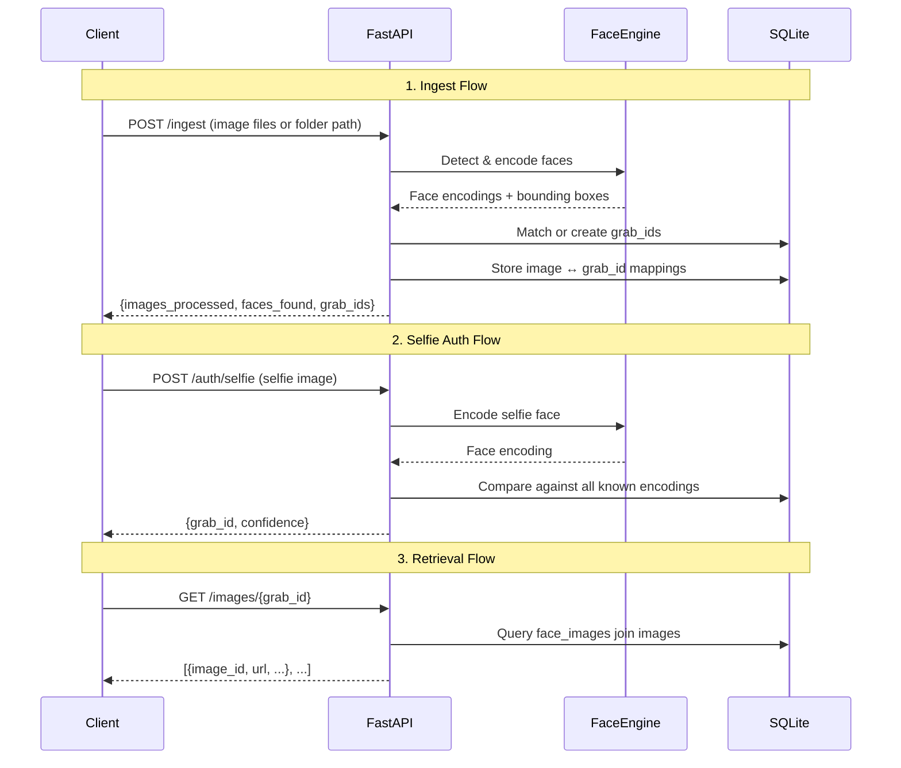

# Grabpic — Hackathon Strategy & Implementation Plan

## ⏱️ Time Budget (1h 45m = 105 minutes)

| Phase | Time | What |
|-------|------|------|
| **Setup & Scaffold** | 10 min | Project structure, deps, DB schema |
| **Face Discovery Engine** | 30 min | Crawl storage, detect faces, assign grab_ids |
| **Selfie Auth** | 20 min | Upload selfie → match to grab_id |
| **Image Retrieval API** | 10 min | Fetch all images for a grab_id |
| **Error Handling & Polish** | 15 min | Validation, error responses, edge cases |
| **README & Docs** | 10 min | Architecture diagram, setup steps, cURLs |
| **Buffer** | 10 min | Testing, bug fixes |

---

## 🏗️ Tech Stack Decision

| Component | Choice | Why |
|-----------|--------|-----|
| **Language** | Python | Fast prototyping, rich ML ecosystem |
| **Framework** | FastAPI | Auto Swagger docs (free 5%), async, great error handling |
| **Database** | SQLite + SQLAlchemy | Zero setup, relational, sufficient for hackathon |
| **Face Recognition** | `face_recognition` lib (dlib-based) | Battle-tested, simple API, handles encoding + matching |
| **Image Storage** | Local filesystem | Simple, no cloud setup needed |

> [!TIP]
> FastAPI auto-generates Swagger UI at `/docs` — that's the "Docs & Design" criteria (5%) for FREE.

---

## 📐 Architecture Overview

```
┌─────────────────────────────────────────────────┐
│                   FastAPI Server                 │
├──────────┬──────────────┬───────────────────────┤
│ POST     │ POST         │ GET                   │
│ /ingest  │ /auth/selfie │ /images/{grab_id}     │
├──────────┴──────────────┴───────────────────────┤
│              Face Recognition Engine             │
│         (face_recognition / dlib library)        │
├─────────────────────────────────────────────────┤
│              SQLite Database                     │
│  ┌─────────┐  ┌──────────────┐  ┌────────────┐ │
│  │  faces  │  │ face_images  │  │   images   │ │
│  │(grab_id,│  │ (face_id,    │  │ (id, path, │ │
│  │encoding)│  │  image_id)   │  │  metadata) │ │
│  └─────────┘  └──────────────┘  └────────────┘ │
├─────────────────────────────────────────────────┤
│          Local Filesystem (./storage/)           │
│              Raw images stored here              │
└─────────────────────────────────────────────────┘
```

### Request Flow



---

## 🗄️ Database Schema

```sql
-- Every unique face gets a grab_id
CREATE TABLE faces (
    id TEXT PRIMARY KEY,           -- grab_id (UUID)
    encoding BLOB NOT NULL,        -- 128-d face encoding (numpy→bytes)
    created_at TIMESTAMP DEFAULT CURRENT_TIMESTAMP
);

-- Every ingested image
CREATE TABLE images (
    id TEXT PRIMARY KEY,           -- image_id (UUID)
    filename TEXT NOT NULL,
    filepath TEXT NOT NULL,
    width INTEGER,
    height INTEGER,
    ingested_at TIMESTAMP DEFAULT CURRENT_TIMESTAMP
);

-- Many-to-many: one image can have multiple faces
CREATE TABLE face_images (
    face_id TEXT REFERENCES faces(id),
    image_id TEXT REFERENCES images(id),
    bbox_top INTEGER,
    bbox_right INTEGER,
    bbox_bottom INTEGER,
    bbox_left INTEGER,
    PRIMARY KEY (face_id, image_id)
);
```

> [!IMPORTANT]
> The `face_images` junction table is critical — it satisfies the "one image to many grab_ids" requirement (10% of score).

---

## 🔌 API Endpoints

### 1. `POST /ingest` — Discovery & Transformation (20% + 10%)
```
Request:  multipart/form-data with image files OR JSON {"folder": "./storage/marathon"}
Response: {
    "images_processed": 150,
    "faces_discovered": 423,
    "new_grab_ids_created": 87,
    "existing_grab_ids_matched": 336
}
```

**Logic:**
1. For each image → detect all faces → get 128-d encodings
2. For each face encoding → compare against existing `faces` table (tolerance ~0.6)
3. If match found → use existing `grab_id`; else create new `grab_id`
4. Store `(grab_id, image_id)` in `face_images`

### 2. `POST /auth/selfie` — Selfie Authentication (15%)
```
Request:  multipart/form-data with one selfie image
Response: {
    "authenticated": true,
    "grab_id": "abc-123-def",
    "confidence": 0.87,
    "total_images": 12
}
```

**Logic:**
1. Detect face in selfie → get encoding
2. Compare against all stored encodings
3. Return best match if within tolerance

### 3. `GET /images/{grab_id}` — Data Extraction (25% of working APIs)
```
Response: {
    "grab_id": "abc-123-def",
    "total_images": 12,
    "images": [
        {"image_id": "...", "filename": "IMG_001.jpg", "url": "/static/IMG_001.jpg"},
        ...
    ]
}
```

### 4. `GET /faces` — List all known identities (bonus)
```
Response: {
    "total_faces": 87,
    "faces": [{"grab_id": "...", "image_count": 12}, ...]
}
```

### 5. `GET /health` — Health check

---

## 🎯 Prioritized Execution Order

Based on judging weights, build in this exact order:

### Step 1: Project Scaffold (10 min)
- [x] Create project structure
- [ ] Install dependencies
- [ ] Setup FastAPI app with error handling middleware
- [ ] Create SQLite models
- [ ] Setup `/health` endpoint
- [ ] Setup `/docs` (auto from FastAPI)

### Step 2: Face Discovery Engine (30 min) — **45% of score**
- [ ] Image loading and validation
- [ ] Face detection using `face_recognition.face_locations()`
- [ ] Face encoding using `face_recognition.face_encodings()`
- [ ] Matching logic: compare new encoding vs existing (tolerance=0.6)
- [ ] Create or reuse `grab_id`
- [ ] Build `POST /ingest` endpoint (single file + batch folder)
- [ ] Handle multiple faces per image

### Step 3: Selfie Auth (20 min) — **15% of score**
- [ ] `POST /auth/selfie` endpoint
- [ ] Extract face from uploaded selfie
- [ ] Compare against all stored encodings
- [ ] Return best match with confidence score
- [ ] Error handling: no face in selfie, no match found

### Step 4: Image Retrieval (10 min) — **Part of 25%**
- [ ] `GET /images/{grab_id}` endpoint
- [ ] Serve actual image files via static mount
- [ ] `GET /faces` bonus endpoint

### Step 5: Polish (15 min) — **15% of score**
- [ ] Proper HTTP status codes (400, 404, 422, 500)
- [ ] Input validation (file types, size limits)
- [ ] Consistent JSON response schema
- [ ] Error response model

### Step 6: Docs & README (10 min) — **15% of score**
- [ ] README with architecture diagram
- [ ] Setup/run instructions
- [ ] cURL examples for every endpoint
- [ ] Swagger is auto-generated

---

## 📁 Project Structure

```
grabpic/
├── app/
│   ├── __init__.py
│   ├── main.py              # FastAPI app, CORS, error handlers
│   ├── database.py          # SQLAlchemy setup, models
│   ├── models.py            # Pydantic response models
│   ├── routers/
│   │   ├── __init__.py
│   │   ├── ingest.py        # POST /ingest
│   │   ├── auth.py          # POST /auth/selfie
│   │   └── images.py        # GET /images/{grab_id}, GET /faces
│   └── services/
│       ├── __init__.py
│       └── face_engine.py   # All face_recognition logic
├── storage/                  # Raw images folder (crawled)
├── requirements.txt
├── README.md
└── .gitignore
```

---

## ⚠️ Key Technical Decisions

> [!WARNING]
> **`face_recognition` requires `dlib` which needs CMake and C++ build tools.**
> If installation is slow, fallback to `deepface` library which uses pip-only deps.
> Alternative: `insightface` (also pip-installable, GPU-optional).

> [!NOTE]
> **Face encoding storage**: Store `numpy` arrays as bytes in SQLite BLOB column. 
> For matching, load all encodings into memory — fine for hackathon scale.
> In production, you'd use a vector DB like pgvector or Pinecone.

> [!TIP]
> **Tolerance tuning**: `face_recognition.compare_faces()` default tolerance is `0.6`. 
> Lower = stricter matching (fewer false positives), Higher = more lenient.
> For a marathon scenario with varied angles/lighting, `0.5-0.6` is good.

---

## User Review Required

> [!IMPORTANT]
> 1. **Do you want me to start building this immediately?** Given the time constraint, I recommend we start coding right away.
> 2. **Face recognition library**: `face_recognition` (needs CMake/dlib) vs `deepface` (easier install) vs `insightface`. Do you have CMake installed, or should I use `deepface`?
> 3. **Do you have sample images** to test with, or should I include a script to generate test data?
